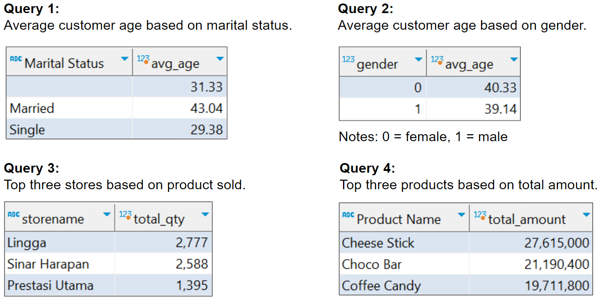

# Sales Quantity Prediction & Customer Segmentation Using ARIMA and K-Means Clustering

## 1. Goals & Objectives
**Goals:**
1. Predict the daily number of sales (quantity) of all Kalbe products in January 2023.
2. Create customer clusters/segments to provide personalized promotions and sales treatment.

**Objectives:**
1. Analyze historical transaction data to discover insights and patterns.
2. Create a machine learning using ARIMA model to predict the daily number of sales and K-Means Clustering to create customer clusters/segments.

## 2. Exploratory Data Analysis
Using SQL and Tableau we will do exploratory data analysis for the transaction data.
### 2.1. SQL

### 2.2. Tableau

  <a href="https://public.tableau.com/app/profile/oktavian.dwi.putra/viz/KalbeNutrionals-SalesPerformanceDashboard/Dashboard">Sales Performance Dashboard in Tableau Public</a>

## 3. Sales Quantity Prediction
After we found the parameters for ARIMA model (p = 28, d = 0, q = 28), we can train the model with the data train and make prediction with the data test. We can visualize the result between the actual data and the predictions like in the image below.

We can also use the model to predict the quantity of product needed for sales in January 2023. Based on the prediction result, the number of quantities needed in January 2023 has integer statistic values: 

**Mean: 50, Median: 50, Min: 32, Max: 60, Total: 1545**

## 4. Customer Segmentation
### 4.1. Elbow Method

### 4.2. Silhouette Score

From the elbow method and silhouette score plot, we can conclude that the optimal number of **clusters is 3**.

### 4.3. Cluster Visualization
Using K-Means Clustering we can create customer clusters and visualize them like the images below.

  
  

### 4.4. Interpretation

**Cluster 0	: Low-Level Customer** 
Customers who make infrequent transactions, buy small quantities, and generate low total amounts. 

**Cluster 1	: Mid-Level Customer** 
Customers who have moderate transaction frequency, purchase medium quantities, and generate intermediate total amounts. 

**Cluster 2	: High-Level Customer**  
Customers who make frequent transactions, buy large quantities, and generate high total amounts.

### 4.5. Business Recommendation

**Cluster 0	: Low-Level Customer** 
- Use special promotions and discounts to encourage more frequent purchases. We can also use email marketing and personalized offers to re-engage them. 
- Offer recommendations for complementary products or services to increase the size of their orders. 

**Cluster 1	: Mid-Level Customer** 
- Focus on retaining and growing the loyalty using personalized loyalty programs that offer incentives and rewards for continued shopping. 
- Analyze their purchase history to identify products or services that are commonly bought together. Promote cross-selling and upselling opportunities to increase their average transaction value. 

**Cluster 2	: High-Level Customer**  
- Create exclusive offers, early access, and personalized experiences for this cluster to make them feel valued. 
- Reward VIP customers for their loyalty and encourage them to refer friends and family to our business. Consider creating a referral program that benefits both parties. 
- Identify high-value products or services and promote them to this cluster. Offer bundled packages or discounts for premium offerings.

